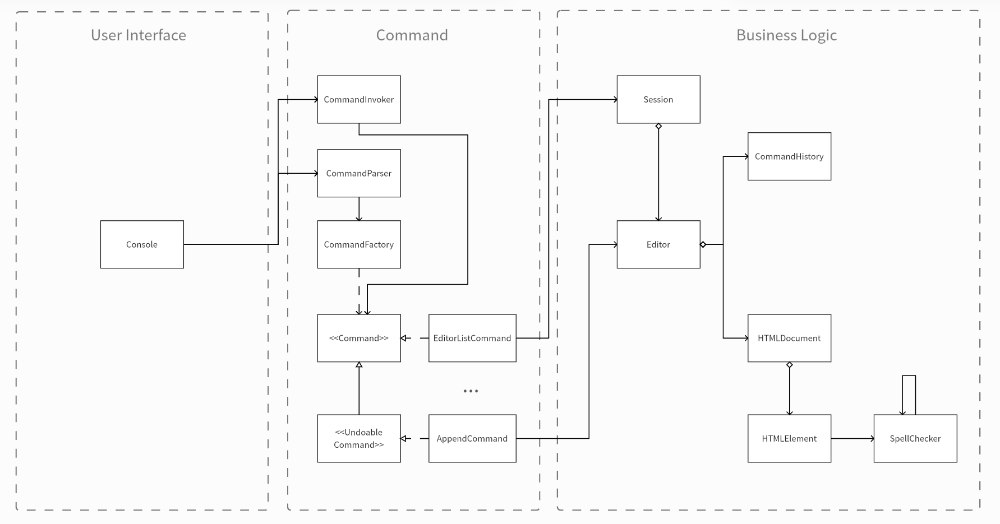
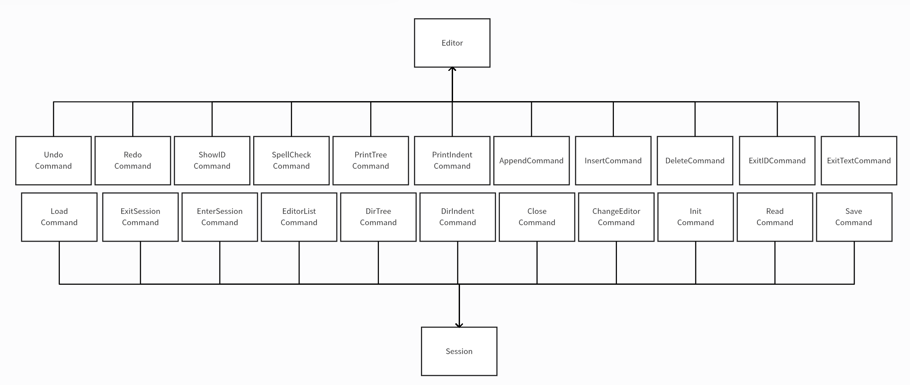

# Lab1 : HTML-Editor
## 小组成员
第八组：
* 24210240176	黄德立
* 24210240192	郎维佳
* 24210240332	魏嘉林
* 24210240437	朱俊杰
* 24210240442	朱元依(组长)

## 功能模块总述



本项目完成了**基本需求+增强部分**需求。上图为本项目的功能模块描述图，主要分为三个模块：1. **User Interface** 2. **Command** 3. **Business Logic**

### User Interface

该模块主要实现与用户交互的功能，并提供用户命令结果显示以及错误输入提示的功能。

目前实现的界面为命令行界面。

### Command

该模块是整个项目的中间模块，主要负责用户输入命令的解析，以及对应命令对象的创建和调用的功能。

在模块的设计中，采用了大量的设计模型，包括但不限于：**命令模式**、**工厂模式**、**策略模式**、**组合模式**、**访问者模式**、**单例模式**、**构建者模式**。

### Business Logic

该模块是项目的业务模块，负责具体的业务操作的实现，包括：HTML文档的读取、保存、增删改查等等操作。

在模块的设计中，`HTMLDocument`类与`HTMLElement`类是一个组合关系，同时负责拼写检查的`SpellChecker`类被设计为单例模式。

-----

## 功能模块描述

### Console
#### 需求简述
Console类是一个命令行界面，主要用于与用户交互。其中，包含main函数。
- 读取用户输入
- 返回对应的输出或报错

#### 功能开发逻辑
##### 1. 核心组件
- CommandParser：命令解析的主控制器
- Session：会话管理
- InputStream：用户输入流，default为System.in
- PrintStream：Console输出流，default为System.out
- CommandInvoker：命令执行和存储的主控制器

##### 2. 主要处理流程
  1. 初始化组件
  2. 循环处理用户输入，直至退出
     1. 获取用户输入
     2. 解析为命令
     3. 运行命令
     4. 返回对应的输出或报错，包括异常处理

----

### CommandParser

#### 需求简述
CommandParser 类是一个命令解析器，主要用于解析和处理用户输入的命令。该解析器需要能够：
- 处理不同格式的命令输入
- 支持带参数和不带参数的命令
- 对特殊命令（如edit-text、insert、append）进行特殊处理
- 确保命令格式的正确性和参数的完整性

#### 功能开发逻辑

##### 1. 核心组件
- CommandParser：命令解析的主控制器
- CommandFactory：命令对象的创建工厂
- Session：会话管理
- Command：命令接口或抽象类

##### 2. 主要处理流程
1. 命令输入验证
    - 检查输入是否为空
    - 移除首尾空白字符

2. 命令分割处理
    - 将输入按空格分割为命令名和参数部分
    - 根据命令是否包含参数决定处理方式

3. 参数解析流程
    - 普通命令：直接按空格分割参数
    - 特殊命令（edit-text、insert、append）：保留文本内容的完整性

4. 命令创建
    - 通过 CommandFactory 创建对应的命令对象
    - 根据参数数量选择适当的工厂方法

#### 设计模式说明

##### 1. 工厂模式
- **实现方式**：使用 CommandFactory 类创建不同类型的命令对象
- **优势**：
    - 封装了命令对象的创建逻辑
    - 提供了统一的命令创建接口
    - 便于扩展新的命令类型

##### 2. 命令模式
- **实现方式**：通过 Command 接口定义统一的命令执行接口
- **优势**：
    - 将命令请求封装为对象
    - 支持命令的参数化
    - 便于实现命令的撤销和重做功能

##### 3. 单一职责原则
- **体现**：CommandParser 类专注于命令解析逻辑
- **优势**：
    - 提高代码的内聚性
    - 降低代码的耦合度
    - 便于维护和测试

#### 关键方法说明

##### processCommand 方法
- **功能**：处理输入的命令字符串
- **参数**：String input - 用户输入的命令
- **返回值**：Command 对象
- **异常处理**：
    - IllegalArgumentException：命令为空时抛出
    - ElementNotFound：元素未找到时抛出

##### parseCommandArgs 方法
- **功能**：解析命令参数
- **特殊处理**：
    - edit-text 命令：保留文本内容的完整性
    - insert/append 命令：处理必需参数和可选文本内容

-----

### CommandFactory
#### 需求简述
CommandFactory 类是一个命令工厂，负责创建和管理各种命令对象。主要需求包括：
- 统一管理所有命令的创建逻辑
- 验证命令格式的正确性
- 支持灵活的命令注册机制
- 提供命令参数的验证功能
- 维护命令的格式规范

#### 功能开发逻辑

##### 1. 命令系统架构
命令系统按功能分为以下几类：
1. IO命令：init、read、save
2. 显示命令：print-indent、print-tree、spell-check
3. 编辑命令：insert、append、edit-id、edit-text、delete
4. 历史命令：redo、undo
5. 会话命令：exit、load、close、editor-list、edit

##### 2. 核心组件设计
1. CommandFormat 内部类
    - 管理命令的参数规范
    - 存储命令的使用格式
    - 定义参数的数量限制

2. CommandCreator 函数式接口
    - 定义命令创建的统一接口
    - 支持 lambda 表达式创建命令

3. 数据存储
    - commandMap：存储命令名称与创建器的映射
    - commandFormats：存储命令格式规范

#### 设计模式说明

##### 1. 工厂模式
- **实现方式**：使用 CommandFactory 统一创建各类命令对象
- **核心组件**：
    - CommandFactory：主工厂类
    - CommandCreator：命令创建接口
    - Command：抽象命令接口
- **优势**：
    - 封装对象创建逻辑
    - 统一管理命令实例化
    - 便于扩展新命令

##### 2. 命令模式
- **实现方式**：通过不同的命令实现类封装具体操作
- **分类实现**：
    - IOCommand
    - displayCommand
    - editCommand
    - historyCommand
    - sessionCommand
- **优势**：
    - 命令的封装和解耦
    - 支持命令的撤销和重做
    - 便于添加新的命令类型

##### 3. 单例模式
- **实现方式**：通过 Session 管理编辑器状态
- **优势**：
    - 确保命令执行的状态一致性
    - 集中管理编辑器资源

##### 4. 策略模式
- **实现方式**：通过 CommandCreator 接口实现不同的命令创建策略
- **优势**：
    - 支持灵活的命令创建策略
    - 便于修改和扩展命令创建逻辑

#### 关键方法说明

##### initCommandFormats 方法
- **功能**：初始化所有支持的命令格式
- **实现要点**：
    - 定义每个命令的参数规范
    - 设置参数数量的上下限
    - 提供命令使用的格式说明

##### registerCommands 方法
- **功能**：注册所有可用的命令
- **实现要点**：
    - 使用 lambda 表达式简化命令创建
    - 为每个命令指定具体的创建逻辑
    - 关联命令与其对应的编辑器操作

##### validateCommandFormat 方法
- **功能**：验证命令格式的正确性
- **验证内容**：
    - 命令是否存在
    - 参数数量是否符合要求
    - 提供详细的错误信息

#### 使用注意事项
1. 新增命令时需要：
    - 在 initCommandFormats 中定义格式
    - 在 registerCommands 中注册创建逻辑
    - 实现对应的命令类

2. 参数验证：
    - 确保参数数量符合规范
    - 注意特殊命令的参数处理
    - 处理可选参数的默认值

3. 错误处理：
    - 未知命令抛出 IllegalArgumentException
    - 参数错误提供详细的错误信息
    - 确保命令创建的健壮性

----

### CommandInvoker

#### 需求简述
CommandInvoker 类是一个命令执行器，负责执行和执行历史管理。主要需求包括：
- 执行命令
- 存储命令

#### 功能开发逻辑
##### 1. 核心组件
- Session：会话管理

##### 2. 主要处理流程
  1. 执行命令
  2. 找到当前session中的activeEditor，在对应的CommandHistory中存储命令

### CommandHistory

#### 需求简述
- **命令历史管理**：记录和管理可撤销和可重做的操作
- **撤销和重做机制**：提供对已执行命令的撤销和重做功能
- **状态追踪**：跟踪当前可撤销和可重做的操作状态
- **命令栈管理**：使用两个栈（撤销栈和重做栈）管理命令历史

#### 功能开发逻辑
##### (1) 命令栈初始化
- 创建两个独立的栈：`undoStack`和`redoStack`
- `undoStack`存储可以撤销的命令
- `redoStack`存储可以重做的命令

##### (2) 命令入栈管理
- `push(Command command)`方法
    - 检查命令是否可撤销
    - 将可撤销命令压入`undoStack`
    - 清空`redoStack`，确保新命令执行后之前的重做记录失效

##### (3) 撤销操作
- `undo()`方法
    - 检查`undoStack`是否为空
    - 弹出最近的可撤销命令
    - 将命令压入`redoStack`
    - 执行命令的撤销逻辑
    - 如栈为空，抛出`NoUndoableOperationException`

##### (4) 重做操作
- `redo()`方法
    - 检查`redoStack`是否为空
    - 弹出最近的可重做命令
    - 将命令压入`undoStack`
    - 重新执行命令
    - 如栈为空，抛出`NoRedoableOperationException`

##### (5) 状态检查
- `canUndo()`：检查是否有可撤销的操作
- `canRedo()`：检查是否有可重做的操作
- 通过检查两个栈的非空状态实现

##### (6) 辅助方法
- `peekLast()`：获取最后执行的命令，但不移除
- 如无可撤销命令，抛出`NoUndoableOperationException`

##### (7) 异常处理
- 自定义异常：`NoUndoableOperationException`
- 自定义异常：`NoRedoableOperationException`
- 确保在无可撤销或可重做操作时提供明确的错误提示

##### (8) 设计模式应用
- 命令模式：将请求封装为对象，支持撤销和重做
- 栈数据结构：高效管理命令历史
- 单一职责原则：CommandHistory专注于命令历史管理

----

### Command

#### 需求简述
Command 接口是一个抽象命令，定义了命令的执行逻辑。主要需求包括：
- 执行命令

#### 功能开发逻辑
1. execute(): 抽象方法，定义命令的执行逻辑，继续向上抛出异常


### UndoableCommand
#### 需求简述
UndoableCommand 接口是一个可撤销的命令，继承自 Command 接口。主要需求包括：
- 执行命令
- 撤销命令

#### 功能开发逻辑
1. undo(): 抽象方法，定义命令的撤销逻辑，继续向上抛出异常

### ConcreteCommand



ConcreteCommand 代指一系列Command的具体实现（具体见src/main/java/command/commandImpl/*），实现了 Command 接口和 UndoableCommand 接口。主要需求包括：
- displayCommand：显示类命令
  - printTreeCommand：HTML文件的树形显示
  - printIndentCommand：HTML文件的缩进显示
  - ShowIDCommand：控制是否显示元素ID
  - SpellCheckCommand：拼写检查
- editCommand：编辑类命令
  - EditTextCommand：编辑元素文本
  - InsertCommand：在某个位置之前插入元素
  - AppendCommand：在某个父节点下追加元素
  - DeleteCommand：删除元素
  - EditIDCommand：编辑元素ID
  - EditTextCommand：编辑元素文本
- historyCommand：历史类命令
  - RedoCommand：重做命令
  - UndoCommand：撤销命令
- IOCommand：IO类命令
  - initCommand：初始化编辑器
  - loadCommand：加载文件到编辑器
  - saveCommand：保存编辑器内容到文件
  - ReadCommand：读取文件到编辑器
- sessionCommand：会话类命令
  - ChangeEditorCommand：切换编辑器
  - CloseCommand：关闭编辑器
  - ExitSessionCommand：退出会话
  - EditorListCommand：列出所有编辑器
  - DirTreeCommand：HTML文件所在文件夹的树形显示
  - DirIndentCommand：HTML文件所在文件夹的缩进显示

#### 功能开发逻辑
1. execute(): 
   1. 若为undoableCommand，保存撤销所需信息
   2. 调用对应的后端业务逻辑，传递参数
2. undo(): 
   1. 获取保存的撤销信息，调用撤销对应的后端业务逻辑
* **注意：Command只用于信息的传递，不应该包含任何业务逻辑**

#### 设计模式说明

##### 1. 命令模式
- **实现方式**：通过不同的命令实现类封装具体操作
- **优势**：
    - 便于解耦前端接口和后端业务逻辑
    - 支持命令的撤销和重做
    - 便于添加新的命令类型

### Editor
#### 需求简述
- **文档管理**：加载、保存、创建和关闭HTML文档
- **文档编辑**：支持添加、删除、修改HTML元素
- **文档展示**：支持多种格式显示（树形、缩进）
- **文档操作历史**：支持撤销(undo)和重做(redo)
- **文档状态跟踪**：记录文档是否被修改
- **额外功能**：拼写检查、ID显示控制

#### 功能开发逻辑
##### (1) 文档基础操作
- `init()`: 初始化新文档
- `load(filename)`: 加载已有文档或创建新文档
- `save(filename)`: 保存文档到指定文件
- `close()`: 关闭文档，提示保存修改
- `getFileName()`: 获取当前文档名称

##### (2) 文档编辑功能
- `append()`: 在指定父元素下添加新元素
- `insert()`: 在指定位置插入新元素
- `delete()`: 删除指定ID的元素
- `editId()`: 修改元素的ID
- `editText()`: 修改元素的文本内容

##### (3) 历史记录管理
- `executeCommand()`: 执行命令并记录
- `storeCommand()`: 存储命令到历史记录
- `undo()`: 撤销上一个操作
- `redo()`: 重做已撤销的操作
- `updateModifiedState()`: 更新文档修改状态

##### (4) 显示与格式化
- `display()`: 显示当前文档内容
- `printTree()`: 以树形结构显示文档
- `printIndent()`: 以缩进格式显示文档
- `showId()`: 控制是否显示元素ID
- `spellCheck()`: 执行拼写检查

##### (5) 状态管理
- `isModified()`: 检查文档是否被修改
- `toggleModified()`: 切换文档修改状态
- `setShowId()`: 设置是否显示元素ID


### HTMLDocument
#### 需求简述
HTMLDocument 类是一个 HTML 文档处理器，主要负责：
- HTML 文档的树形结构管理
- 元素的增删改查操作
- 文档的格式化输出
- 拼写检查功能
- 文档的序列化和反序列化

#### 功能开发逻辑

##### 1. 数据结构设计
1. 核心数据结构
    - HTMLElement：表示 HTML 元素节点
    - 树形结构：使用父子关系维护文档结构
    - idSet：用于快速验证 ID 唯一性
    - isLastChild：用于树形显示的格式控制

2. 文档状态管理
    - showID：控制是否显示元素 ID
    - templatePath：模板文件路径
    - StringBuilder：用于高效字符串拼接

##### 2. 主要功能模块

###### 2.1 文档操作
1. 初始化与读取
   ```java
   public void init()
   public void read(File input)
   ```

2. 元素管理
   ```java
   public void appendElement(String tagName, String idValue, String textContent, String parentElement)
   public void insertElement(String tagName, String idValue, String insertLocation, String textContent)
   public void removeElementById(String id)
   ```

3. 元素编辑
   ```java
   public void editID(String oldID, String newID)
   public void editText(String id, String newText)
   ```

###### 2.2 文档展示
1. 格式化输出
   ```java
   public String getIndentFormat(int indent)
   public String getTreeFormat(boolean spellCheck)
   ```

2. 拼写检查
   ```java
   public String getSpellCheck()
   ```

#### 设计模式说明

##### 1. 组合模式
- **实现方式**：通过 HTMLElement 的树形结构实现
- **核心组件**：
    - HTMLElement：组件类
    - children：子元素集合
- **优势**：
    - 统一处理单个元素和元素组合
    - 简化树形结构的遍历和操作
    - 支持递归操作

##### 2. 建造者模式
- **实现方式**：使用 HTMLElement.Builder 创建元素
- **优势**：
    - 分步构建复杂对象
    - 支持可选参数
    - 确保对象构建的完整性

##### 3. 访问者模式
- **实现方式**：通过不同的格式化方法访问元素
- **具体实现**：
    - getIndentFormat：缩进格式访问
    - getTreeFormat：树形格式访问
    - getSpellCheck：拼写检查访问
- **优势**：
    - 分离算法和对象结构
    - 支持多种输出格式
    - 易于添加新的访问方式

#### 异常处理机制

##### 1. 自定义异常
```java
ElementNotFound：元素未找到异常
ElementDuplicateID：重复 ID 异常
ElementBadRemoved：错误删除异常
```

##### 2. 异常处理策略
1. 元素操作验证
    - ID 唯一性检查
    - 父元素存在性检查
    - 根元素保护

2. 错误恢复机制
    - 事务性操作
    - 状态回滚支持

#### 性能优化考虑

##### 1. 内存优化
1. StringBuilder 使用
    - 重用 StringBuilder 实例
    - 清空而非创建新实例

2. 集合优化
    - 使用 HashSet 存储 ID
    - 避免重复遍历

##### 2. 算法优化
1. 元素查找
    - ID 索引优化
    - 递归查找优化

2. 格式化输出
    - 缓存机制
    - 按需计算

#### 使用注意事项
1. ID 管理
    - 确保 ID 唯一性
    - 特殊元素 ID 处理

2. 文档操作
    - 根元素保护
    - 父子关系维护
    - 格式化参数设置

3. 异常处理
    - 捕获相关异常
    - 状态一致性维护

-----

### HTMLElement

#### 需求简述
该模块的目的在通过Builder模式实现HTML元素的高效构造与操作，以简化复杂HTML结构的创建过程，同时支持基本的HTML节点操作（如插入、删除、兄弟节点链接更新等）。实验的具体目标包括：
1. 实现一个支持延迟初始化和线程安全的HTML节点树；
2. 提供灵活的Builder模式，简化HTML节点的构造与操作；
3. 通过功能接口扩展性，支持自定义操作（如拼写检查和元素位置插入）。
4. 特殊要求：为了简化要求，本次 Lab 中对于 HTML 的约定如下：
（1）`<html>`, `<head>`,` <title>` ,` <body>`四个标签有且仅有一个。HTML 文件顶层是`<html>`元素，其只有两个子元素，依序为`<head>`和`<body>`。同时，`<title>`是`<head>`的子元素。结构如下：

```html
<html>
  <head>
    <title>My Webpage</title>
  </head>
  <body>
    ...
  </body>
</html>
```
（2）元素内部可以包含文本内容，但文本必须处在该元素的其他子元素之前（参见上述例子中的`<div id="footer">`）。
（3）属性只支持 id，除`<html>`, `<head>`,` <title>` ,` <body>`外其他元素必须拥有 id 属性，若这四个标签没有提供 id，默认 id 为标签名。同时 id 应该具有唯一性。
#### 功能开发逻辑
（1）功能模块划分：

代码主要分为两个核心模块：
1.1 **抽象基类 `HTMLElement`**：
    - 定义HTML节点的基本结构与行为。
    - 提供Builder接口定义以及通用的逻辑实现（如延迟初始化、子节点管理）。
1.2 **具体实现类 `HTMLElementImpl`**：
    - 实现具体的HTML节点行为（如插入、删除、展示）。
    - 实现Builder模式的具体逻辑。

##### Builder模式的逻辑与实现
通过Builder模式，我们能够灵活构造复杂的HTML节点树，避免直接使用构造函数导致的代码冗长。核心逻辑如下：
1. **抽象接口定义**：
   在`HTMLElement`中定义Builder接口，使得构造行为与节点类分离。
2. **具体实现类 `HTMLElementImpl.BuilderImpl`**：
   提供具体的构造逻辑，允许按需设置`tagName`、`id`、`className`等属性。
   使用链式方法调用，提高代码可读性。
3. **拼写检查扩展**：
   在构造完成后，通过`SpellChecker`对文本内容进行拼写检查并存储结果。

##### 延迟初始化与多线程安全
1. **延迟初始化 `initializeChildren`**：
   在子节点首次访问时，延迟初始化`children`列表，避免不必要的资源消耗。
   引入“哨兵节点”(`start`和`tail`)，简化节点操作逻辑。
2. **多线程安全**：
   使用`volatile`和`synchronized`保证`children`的线程安全初始化，避免重复操作。

##### HTML节点树的操作
1.插入操作
- **位置插入（`insertElementBefore`）**：
  通过目标ID定位插入位置，在目标节点之前插入新节点。
  更新节点的`parent`、兄弟节点指针、索引等信息。
- **默认尾部插入**：
  若目标ID为空，则自动插入到尾部节点前。

2.删除操作
- **通过实例删除（`removeChild`）**：
  根据传入的节点实例，更新父节点、兄弟节点指针并从子节点列表中移除。
- **通过ID删除（`removeChild(String id)`）**：
  根据ID定位并删除指定节点。

3.拼写检查功能
- 利用单例模式的`SpellCheckerManager`对文本内容进行检查，返回修正后的结果。
- 拼写检查结果通过`setSpellCheckResults`存储，支持后续操作。

-----

### SpellChecker

* 需求简述：选择合适的拼写检查服务，实现对元素中的文本内容进行拼写检查，并报告错误.
* 功能开发逻辑：
##### 1.**拼写检查集成**
在`build`方法中调用`SpellChecker`对文本内容进行拼写检查。
修正后的文本存储在`HTMLElement`实例中，确保拼写正确。


##### 2. 拼写检查功能开发

(1) **拼写检查器实现**
使用LanguageTool库的`JLanguageTool`实现拼写检查功能。
遍历拼写错误，利用LanguageTool提供的建议修正文本。
修正逻辑采用倒序替换，避免因位置偏移导致错误替换。

(2) **单例模式优化**
在`SpellCheckerManager`中，使用双重检查锁机制实现线程安全的单例模式。
确保拼写检查器`SpellChecker`的实例唯一性，避免资源浪费。
通过`getInstance`方法提供全局访问点，方便在多模块中使用。

-----

### Session

#### 需求简述
- **会话管理**：管理当前会话的ID、文件列表以及活跃编辑器
- **文件操作**：支持加载、保存、关闭文档，并追踪文档的修改状态
- **文件目录展示**：支持以树形结构或缩进格式显示当前编辑文件所在目录
- **会话数据持久化**：支持将会话数据存储到文件，以及从文件恢复会话数据
- **多文件编辑支持**：支持多个文件同时编辑，并标识当前正在编辑和修改的文件
- **会话退出**：退出会话时自动保存会话状态

#### 功能开发逻辑
##### (1) 会话基础操作
- `Session(String id)`: 构造函数，初始化会话，尝试从文件恢复会话数据。
- `enter(String id)`: 进入一个新会话，恢复该会话的文件和编辑器信息。
- `exit()`: 退出当前会话，保存会话数据到文件。
- `getId()`: 获取当前会话的ID。

##### (2) 会话数据持久化
- `dump(String filename)`: 将当前会话的状态（文件列表、编辑器状态）保存到文件。
- `recover(String filename)`: 从文件恢复会话数据，包括文件列表、编辑器及其状态。
- `load(String filename)`: 加载并打开一个文件，创建对应的编辑器并激活该编辑器。
- `save(String filename)`: 保存当前编辑器的内容到文件。

##### (3) 文件和编辑器操作
- `confirm()`: 检查当前活跃编辑器的文档是否已修改。
- `close()`: 关闭当前编辑器，移除文件和编辑器的关联。
- `getEditorList()`: 获取所有文件的列表，标识哪些文件已修改并显示正在编辑的文件。
- `activateEditor(String filename)`: 激活指定的编辑器。
- `isModified(File file)`: 检查指定文件是否已修改。
- `isEditing(File file)`: 检查指定文件是否为当前活跃的编辑文件。

##### (4) 文件目录展示
- `getDirTreeFormat(int level)`: 获取当前编辑文件所在目录的树形结构格式。
- `getDirIndentFormat(int indent)`: 获取当前编辑文件所在目录的缩进格式。
- `printFile(File file, int indent, StringBuilder sb, String sep)`: 打印目录中的文件和其修改状态。
- `printIndent(File dir, int indent, StringBuilder sb)`: 递归打印目录及其子目录的文件信息。

##### (5) 会话状态管理
- `isInSession(File file)`: 检查文件是否在当前会话中。
- `setShowId(boolean showId)`: 设置是否显示文件的ID。

##### (6) 会话退出与恢复
- `exit()`: 在退出时保存当前会话状态。
- `recover(String filename)`: 在启动时从文件中恢复会话数据。

#### 设计模式
1. **单例模式**：通过`Session`类中的`enter`方法控制会话的唯一性，确保同一时间只有一个有效的会话实例。通过保存和恢复会话状态，使得会话的数据能够跨会话持续存在，防止多个会话实例的冲突。

2. **备忘录模式**：通过`dump`和`recover`方法，保存和恢复会话的状态。`DumpType`类充当备忘录，用于存储会话的数据（如文件列表和每个文件的编辑器状态），在会话退出或恢复时读取和写入这些数据，以确保会话的状态能够回退到特定时刻。

-----

## 项目环境与运行方式

本项目采用的是Java 1.8 版本，可以选用Gradle 和 Maven任意一种方式进行构建，具体依赖查看所需依赖。

* JDK 1.8 (Java 8)
* Maven 3.x 或更高版本
* Windows 操作系统（推荐 Windows 11）
* 推荐使用IntelliJ IDEA来打开并运行程序

### 项目结构

```shell
docs				文档

gradle				Gradle配置文件

src.main.java       源代码路径

src.main.resources  资源路径

src.main.test       测试路径 
```

### 主程序入口

```sh
src.main.java.Console	# 主程序入口
```

### 项目测试

```
src.main.test
```

测试目录下包括**89**个项目测试，可以通过这些测试来判断项目是否运行正常。

### 所需依赖

**测试框架**

- JUnit Jupiter (版本: 5.7.0)
  - junit-jupiter-api: 用于编写JUnit测试
  - junit-jupiter-engine: JUnit测试运行引擎
- Mockito (版本: 4.11.0)
  - mockito-core: 用于单元测试的模拟框架
  - mockito-junit-jupiter: Mockito与JUnit集成支持

**HTML解析**

- JSoup (版本: 1.15.4)
  - 用途：HTML文档解析和操作

**语言处理**

- LanguageTool English (版本: 5.9)
  - language-en: 英语语言处理支持

**开发工具**

- Lombok (版本: 1.18.20)
  - 用途：通过注解简化Java代码
  - 作用域：provided（编译时使用）

**日志处理**

- SLF4J NOP (版本: 1.7.36)
  - slf4j-nop: SLF4J日志框架的空实现

**编译插件**

- maven-compiler-plugin (版本: 3.8.1)
  - 配置：Java 1.8源代码和目标版本
  - Lombok注解处理器支持

**测试插件**

- maven-surefire-plugin (版本: 2.22.2)
  - 用途：执行单元测试

### 运行样例

```html
Welcome to HTML Editor! (Type 'exit' to quit)
shell> init
shell> print-indent
<html>
  <head>
    <title>
    </title>
  </head>
  <body>
  </body>
</html>
shell> append div container body
shell> print-indent
<html>
  <head>
    <title>
    </title>
  </head>
  <body>
    <div id="container">
    </div>
  </body>
</html>
shell> edit-text container Hello HTML-Editor
shell> print-indent
<html>
  <head>
    <title>
    </title>
  </head>
  <body>
    <div id="container">
      Hello HTML-Editor
    </div>
  </body>
</html>
shell> exit
Object dumped to file: ./data/session_dump
Goodbye!
```


